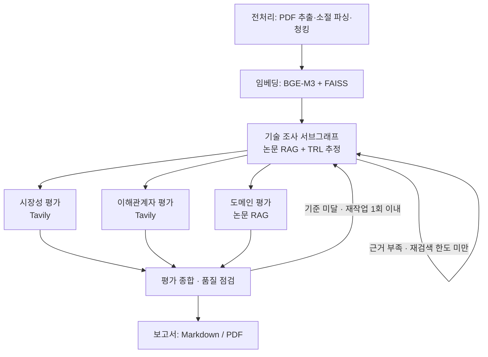

# KV cache 다관점 평가

장문맥 LLM 추론의 **KV-cache 병목**을 서로 다른 계층에서 푸는 두 기술, **DeepSeek-V2 MLA(SW)**와 **CXL-PNM(HW)**을
허용 논문 RAG와 공개 웹 자료로 비교하는 LangGraph 멀티 에이전트입니다. 특정 기술의 우열이나 추천 대신 관점별 평가 차이와 불확실성을 정리합니다.

> 판교 10반 · 박현준 · 이중헌 · 강용현 · 왕채은 · 문진영 · 박지원 · 평가 기준일 2026-09-21

## 한눈에 보기

| 항목 | 내용 |
|---|---|
| 문제 | 장문맥·다중 사용자 LLM 서빙에서 KV-cache 용량·대역폭·데이터 이동이 병목 |
| 비교 대상 | SW: Multi-head Latent Attention(KV를 저차원 잠재 표현으로 압축) / HW: CXL 기반 Processing-Near-Memory(메모리 가까이에서 연산) |
| 적용 도메인 | 데이터센터·클라우드 장문맥 LLM 서빙 (대표 시나리오: 기업 장문서 질의응답) |
| 평가 관점 | 기술 성숙도(TRL) · 시장성 · 이해관계자 · 도메인 적용 → 종합 → 보고서 |
| 근거 | 허용 문서 6편 126쪽(200쪽 한도) 논문 RAG + Tavily 웹 검색 |

## 아키텍처



- 기술·도메인은 사람이 확정했습니다(Human 기반 선정). 기술 선정 노드는 LLM으로 다시 고르지 않고 기술 ID·이름·접근 방식·선정 이유를 State에 기록합니다.
- 세 평가 노드는 서로 다른 State 필드(`market_result`, `stakeholder_result`, `domain_result`)만 갱신하므로 reducer 없이 병렬 실행합니다.
- 각 노드는 `pipeline`에 의존하지 않는 독립 모듈이며 공통 스키마 `service/schema/state.py`의 `AgentResult`로 결과를 냅니다.

## 설계·개발 차별점

### 1. 비교 축이 분명한 기술 선정
두 기술 모두 기존 KV-cache 처리 구조를 점진적으로 튜닝하는 대신 **근본 재설계**를 택합니다. MLA는 **데이터 표현**을, CXL-PNM은 **연산 위치**를 바꿉니다.
같은 병목을 다른 계층에서 풀기 때문에 효과·비용·호환성·성숙도를 같은 서비스 도메인에서 비교할 수 있습니다.

| 비교 항목 | DeepSeek MLA | CXL-PNM |
|---|---|---|
| 변경 계층 | 모델의 어텐션 구조 | 하드웨어의 메모리·연산 배치 |
| 직접 완화 대상 | KV-cache 저장량과 HBM 사용 | 외부 메모리 사용 시 데이터 이동과 GPU 병목 |
| 주요 도입 부담 | 모델 구조 변경과 지원 소프트웨어 | 전용 장치와 시스템 통합 |

### 2. 검증 가능한 문서 RAG
- **문서 범위 관리:** 핵심 논문 2편과 보완 문서 4편(MLA 전환, Pond, PagedAttention, Splitwise)을 합쳐 6편 126쪽이며 200쪽 한도 안입니다. manifest에 문서 ID·쪽수·허용 여부·해시를 기록합니다.
- **구조 보존 청킹:** PDF 추출 후 소절 경계와 페이지를 보존하며 제목 포함 400토큰 이내로 나눕니다. 결과는 청크 557개입니다.
- **임베딩 실측 선정:** 같은 청크·한국어 질문으로 3개 모델을 비교했습니다. BGE-M3는 dev Recall@5 75.0%, MRR@10 0.651, 질의 p50 17.2ms로 Qwen3(MRR 0.601, p50 28.0ms), E5(Recall@5 58.3%)보다 나아서 채택했습니다.
- **FAISS 공용 검색:** 기술별 인덱스와 공통 문서 인덱스를 합쳐 top-5를 반환하며, 모든 노드가 같은 검색기를 씁니다.

### 3. 근거 추적성을 코드로 강제
- 근거 ID(`sw_deepseek_v2_p12_c3`, `web_…`)와 원문 발췌는 **검색 결과에서 코드가 생성**하며 LLM이 만들지 않습니다.
- 모든 Finding은 실제로 수집한 Evidence ID를 참조해야 하고, 알 수 없는 ID를 참조하면 제외하거나 오류로 처리합니다.
- Finding에 `claim_type`(사실·의견·전망), `scope`(직접·연관), `stage`(발표·실증·운영), `stance`(긍정·부정·혼합·확인 불가)를 구조화해 **사실과 해석, 직접 시장과 연관 시장**을 구분합니다.

### 4. 한도가 있는 기술 조사와 공개정보 기반 TRL
- 기술 조사는 `retrieve → analyze → rewrite_queries` 서브그래프입니다. **미충족 기술의 논문만** 수정 질의로 다시 검색하며 기본 2회까지입니다.
- 근거 ID 검증에 실패하면 실패 사유를 피드백으로 넣어 **1회만** 다시 생성하고, 두 번째도 실패하면 `error`로 끝냅니다.
- TRL은 단계·범위, 기준일(2026-09-21), 신뢰도, 미확인 조건을 담은 `trl_assessment`로 기록하며 "공개 정보 기반 추정"임을 명시합니다.

### 5. 근거 없는 주장을 거르는 도메인 평가
평가 기준마다 기술별 논문을 검색하고, 주장 대상 기술의 논문 근거가 연결되지 않은 Finding은 제외한 뒤 `partial`로 표시합니다.
서로 다른 논문의 수치를 직접 순위화하지 않고 모델·문맥 길이·장비 조건을 함께 기록합니다.

### 6. 실측으로 다듬은 시장성·이해관계자 평가
- **확증편향 방지:** 모든 기준을 긍정·부정 질의 쌍으로 검색합니다. 한쪽 방향만 빈약하면 그 방향만 보강 검색하고, 그래도 한쪽 근거뿐이면 "일방적 근거"로 기록합니다.
- **실제 API 실측에서 드러난 LLM 실패를 코드 규칙으로 막았습니다.**

| 실측에서 발견한 문제 | 코드 규칙 |
|---|---|
| CXL 전체 시장 전망을 CXL-PNM의 직접 시장·사실로 표시 | claim과 근거 양쪽에 기술 고유어가 없으면 `adjacent`로, 기준일 이후 연도·전망 표현이 있으면 `forecast`로 교정 |
| Finding 하나에 근거 10~19개를 통째로 연결, 해시 ID를 잘못 옮겨 적음 | 기술 × 기준 칸마다 LLM 1회 호출, 근거 5개 상한, 짧은 참조키(E1…) 변환 |
| 선정 문서의 논문 수치를 무관한 논문 근거에 붙여 "상용화"로 표시 | LLM 입력에서 선정 문서 제외, 학술 자료만으로는 상용화·도입·투자 판단 불가 |
| 요약에 인용 없는 수치·과장이 들어감 | 요약을 LLM 대신 코드가 검증 결과 현황으로 조립 |

자세한 내용은 [시장성·이해관계자 에이전트](docs/MARKET_STAKEHOLDER_AGENT.md)에 있습니다.

### 7. 부분 실패를 구분하는 오류 정책과 품질 루프
- 근거 부족은 `partial`로 표시하고 한계를 기록한 채 진행합니다. 모델·도구 오류는 `error`로 표시하고 자동 무한 반복 없이 중단합니다.
- 평가 종합은 관점 간 일치·상충을 점검하고, 기준에 미달하면 `quality_feedback`으로 기술 조사부터 재작업합니다(최대 1회). 한도에 도달하면 한계를 반영해 보고서를 만듭니다.

## 팀 구성

| 담당 | 범위 |
|---|---|
| 박지원 | 전처리: PDF 추출, 소절 파싱, 정제, 청킹, manifest |
| 문진영 | 임베딩: BGE-M3 임베딩, FAISS 인덱스·공용 검색 |
| 이중헌 | 기술 조사 에이전트: 논문 RAG 서브그래프, TRL 추정 |
| 박현준 | 시장성·이해관계자 에이전트: Tavily 검색, 근거 검증 규칙 |
| 왕채은 | 도메인 평가 에이전트: 기준별 논문 RAG, 근거 연결 검증 |
| 강용현 | 평가 종합·보고서 에이전트: 품질 점검, Markdown/PDF 보고서 |

## 평가 보고서 핵심 포인트

> 전체 그래프 실행으로 보고서를 생성한 뒤 작성합니다. 아래 항목을 보고서의 근거 ID와 함께 채웁니다.

- 관점별 핵심 판단 (MLA / CXL-PNM): TRL 추정 범위, 시장성, 이해관계자 반응, 도메인 적용 조건
- 관점 간 일치하는 평가와 상충하는 평가
- 적용 조건에 따른 평가 차이 (문맥 길이, 동시 사용자, 기존 모델 전환 여부 등)
- 분석의 한계와 추가 확인이 필요한 사항

## Lessons Learned

- **프롬프트 지시만으로는 규칙이 지켜지지 않았습니다.** 실측에서 LLM은 근거를 통째로 붙이고, 해시 ID를 잘못 옮기고, 입력의 다른 문서 수치를 가져왔습니다. 지켜야 하는 규칙은 코드 검증으로 옮겼습니다.
- **가짜 모델 테스트와 실제 실행은 다른 문제를 보여줍니다.** 단위 테스트가 모두 통과한 뒤에도 실측에서 새 실패 유형이 계속 나왔습니다. 녹화한 실제 응답을 재생하는 테스트로 비용 없이 재현했습니다.
- **LLM 입력은 줄일수록 근거가 정확해졌습니다.** 한 번에 모든 근거를 주면 대응 관계가 흐려졌고, 칸 단위로 필요한 근거만 주자 근거 연결이 분명해졌습니다.
- **공용 스키마는 먼저 합의하고 추가만 하게 설계해야 합니다.** 확장 필드를 기본값과 선택 필드로 만들어 다른 팀원 코드 수정 없이 병합했습니다.
- **통합 점검이 없으면 main이 조용히 깨집니다.** 모듈 이동 뒤 삭제된 파일 import가 남았던 경험으로 병합 전 전체 테스트가 필요함을 확인했습니다.

---

아래는 실행 방법과 상세 설계입니다.

## 실행

```sh
git clone https://github.com/chaeeunwang/kv-cache-agentic-rag.git
cd kv-cache-agentic-rag
uv sync --locked
cp .env.example .env
# .env의 OPENAI_API_KEY와 TAVILY_API_KEY 입력
# 전처리 문서를 준비하고 먼저 인덱스 생성 (아래 안내 참조)
uv run -m ingest.embedding.build_index
uv run pipeline.py --max-technical-retries 2
```

기존 설정 파일을 명시해 사용할 수도 있습니다. 키는 복사하거나 결과물에 저장하지 않습니다.

```sh
uv run pipeline.py --env-file /path/to/your/.env
```

지정한 `.env` 값이 프로세스 환경변수보다 우선합니다. 기본 생성 모델은 `gpt-4.1-mini`이며 `OPENAI_MODEL`로 변경합니다. OpenAI 호환 엔드포인트는 `OPENAI_BASE_URL`로 지정합니다. 실제 실행에는 LLM 및 Tavily API 호출 비용이 발생할 수 있습니다.

`--domain`은 실행 도메인을 변경하고 `--selection-reason`은 첨부 문서에 실행별 선정 이유를 추가합니다. 도메인을 변경한 경우 원래 문서의 선정 이유를 새 도메인의 이유로 단정하지 않도록 입력에 표시합니다.

## 파일과 State

| 파일 | 역할 |
|---|---|
| `service/schema/state.py` | 공통 GraphState, Technology, Evidence, Finding, AgentResult, LLM 응답 스키마 |
| `ingest/preprocess/` | PDF 추출, 소절 파싱, 정제, 청킹, manifest 생성 (`database/`) |
| `ingest/embedding/` | 전처리 문서 로딩, 청킹, BGE-M3 임베딩, FAISS 저장 |
| `service/retrieval/paper_index.py` | 공유 FAISS 인덱스 로딩, 질의 임베딩, 기술별 cosine 검색 |
| `artifacts/faiss/` | 공유할 인덱스와 JSON 메타데이터 (Git 제외) |
| `pipeline.py` | 기술 선정, 역할별 분석, 병렬 합류, 보고서, CLI |
| `service/agent/node/technical/` | 기술 조사 노드 묶음: `schema.py`(서브그래프 State·초안 스키마), `retrieval.py`(논문 검색 도구·근거 수집), `model.py`(전용 모델 생성·설정·호출), `prompts.py`(역할·TRL 판정표), `core.py`(순수 검증 규칙), `node.py` |
| `service/agent/graph/technical.py` | 기술 조사 서브그래프 `build_technical_research_graph(index, model=None, max_retries=2, rules=)` |
| `check_technical.py` | 기술 조사 서브그래프만 Mock 인덱스·모델로 점검 |
| `service/agent/node/market.py`, `stakeholder.py` | 시장성·이해관계자 노드 `market_node(state)`, `stakeholder_node(state)` ([설명](docs/MARKET_STAKEHOLDER_AGENT.md)) |
| `service/agent/tavily/` | 두 노드가 공유하는 Tavily 검색·질의 템플릿·근거 검증 |
| `scripts/tavily_live_check.py` | 시장성·이해관계자 노드 실측 실행 (실제 API) |
| `tests/` | API·모델 없이 도는 pytest (`uv run pytest -q`) |
| `service/agent/synthesis/`, `service/agent/report/` | 평가 종합·품질 피드백, 보고서 Markdown·PDF 생성 |
| `check_graph.py` | API 없이 재검색·합류·오류·근거 참조 경로 검사 |
| `docs/` | 원본 논문 및 기술·도메인 선정 문서 |
| `outputs/<실행시각>/` | State, 보고서, 실패 시 오류 종류 (Git 제외) |

공통 입력은 `request`, `target_domain`, `evaluation_criteria`, `technical_retry_count=0`입니다. 결과 필드는 생성 전에는 생략합니다.

| 노드 | 주요 읽기 필드 | 갱신 필드 |
|---|---|---|
| 기술 선정 | 사람의 선정 문서와 공통 입력 | `technologies` |
| 기술 조사 (서브그래프) | 공통 입력, technologies | `technical_result`, `technical_retry_count`, `technical_queries`, `technical_missing_items` |
| 시장 평가 | 공통 입력, technologies, technical_result | `market_result` |
| 이해관계자 평가 | 공통 입력, technologies, technical_result | `stakeholder_result` |
| 도메인 평가 | 공통 입력, technologies, technical_result | `domain_result` |
| 평가 종합 | 네 평가 결과 | `synthesis_result` |
| 보고서 | 선정 문서, 네 평가 및 종합 | `report_markdown`, `report_evidence_ids` |

세 병렬 노드는 서로 다른 필드만 갱신하므로 reducer 없이 기본 덮어쓰기를 사용합니다. 도메인 평가는 동시에 생성 중인 시장 평가를 읽지 않습니다.

`AgentResult`는 `status`, `summary`, `findings`, `evidence`, `limitations`로 통일합니다. 각 Finding은 `technology_ids`, `claim`, `evidence_ids`, `is_inference`를 가지며, Evidence는 `id`, `source_type`, `title`, `url`, `page`, `published_at`, `excerpt`를 보존합니다. 근거 메타데이터와 원문은 검색 결과에서 코드가 생성하며 모델이 만들지 않습니다. LLM 응답의 내부 `criterion`, `next_queries`는 누락 판단과 재검색에만 사용하고 AgentResult에는 넣지 않습니다.

## 재검색 및 오류 정책

- `complete`: SW/HW 각각의 지정 평가 항목에 근거가 연결됨. 의미적 정확성이 자동 검증됐다는 뜻은 아닙니다.
- `partial`: 항목 누락 또는 모델이 판단한 근거 부족. 기술 조사의 필수 항목은 각 기술의 원리·성능·한계·TRL입니다.
- 기술 조사만 `partial`일 때 서브그래프 안에서 수정 질의로 재검색합니다. 재검색은 미충족 항목이 있는 기술의 논문만 다시 검색하며 질의는 최대 4개·500자입니다. `technical_retry_count`는 **추가 조사 횟수**이며 기본 2회, `--max-technical-retries 0`으로 비활성화할 수 있습니다. 설정 범위는 0~5입니다.
- 기술 조사의 근거 ID·기준 검증에 실패하면 실패 사유와 사용 가능한 ID를 피드백으로 넣어 한 번만 다시 생성하고, 두 번째도 실패하면 `error`로 끝냅니다. 논문 검색 자체가 실패하면 확보한 근거를 보존한 `error`를 반환합니다.
- 기술 조사의 TRL Finding은 선택 필드 `trl_assessment`(`level_or_range` 1~9 또는 범위, `as_of`=2026-09-21, `confidence`, `unverified_conditions`, `basis`="공개 정보 기반 추정")를 가지며, 판단 불가는 `level_or_range=null`과 한계 항목으로 남깁니다. 기술 조사 모델은 `service/agent/node/technical/model.py`의 `TECHNICAL_MODEL` 상수로 정하고 키·엔드포인트는 `config.settings`를 따릅니다.
- 재검색 후에도 부족하면 `partial`을 유지하고 `technical_missing_items`와 `limitations`에 남겨 병렬 평가로 진행합니다. 기술 조사 결과가 갱신될 때 기존 충족 항목도 포함하도록 요청합니다.
- 시장·이해관계자·도메인의 `partial`은 그대로 종합합니다. 상위 평가의 부족한 근거와 한계를 종합·보고서에서도 유지합니다.
- 시장성·이해관계자는 Tavily 질의 한쪽 실패나 칸 하나의 LLM 실패를 `error`로 처리하지 않고 limitations에 기록한 뒤 `partial`로 진행합니다. 모든 질의나 모든 칸이 실패할 때만 `error`입니다. 확증편향 방지 조치와 근거 규칙은 [시장성·이해관계자 에이전트](docs/MARKET_STAKEHOLDER_AGENT.md)에 있습니다.
- API·구조화 응답·근거 ID 오류는 해당 결과를 `error`로 기록합니다. 기술 조사 오류는 즉시 그래프를 끝냅니다. 병렬 평가 오류는 합류 후 종합을 `error`로 기록하고 보고서를 생성하지 않습니다. 오류에는 자동 재시도를 하지 않습니다.
- 보고서 형식·인용 오류 또는 PDF 생성 실패는 실행을 중단하고 `FAILED.txt`를 남깁니다. 부분 State는 보존하며 오류 메시지에 API 요청 원문이나 인증값을 저장하지 않습니다.

## RAG와 출처

- [입력 형식과 임베딩 실행 안내](docs/EMBEDDING_PIPELINE.md)에 따라 전처리 문서를 등록하고 인덱스를 생성합니다. 실제 전처리 문서가 아직 없으므로 입력 예시는 계약 설명용입니다.
- [임베딩 모델 선정 설계](EMBEDDING_MODEL_SELECTION.md)에 따른 `BAAI/bge-m3` dense 임베딩입니다. 차원은 모델에서 확인하고 `EMBEDDING_DIMENSION`을 지정하면 일치 여부를 검사합니다.
- 청킹 초기값은 제목 포함 최대 400토큰, overlap 0입니다. 문서 수령 후 설정을 확정합니다. 페이지와 소절 경계를 보존하고 비교 모델의 토크나이저에서도 한도를 확인합니다.
- 전처리 문서에 연결된 원본 쪽수 합계 200페이지를 검사합니다. 쪽수와 허용 여부는 전달받은 등록 정보에 근거하므로 원본 대조가 필요합니다.
- 문서와 질의에 동일한 모델 revision 및 L2 정규화를 적용하며 E5 instruction은 사용하지 않습니다.
- FAISS `IndexFlatIP`로 cosine 검색합니다. SW 또는 HW 문서와 공통 문서의 후보를 합쳐 최종 상위 5개를 반환합니다. BM25는 포함하지 않습니다.
- 공유 임베딩 모델의 추론 호출은 잠금으로 직렬화하여 MPS 동시 호출 충돌을 방지합니다. 평가 노드와 웹 검색은 병렬로 실행됩니다.
- 생성 결과는 `artifacts/faiss/`에 저장합니다. `.faiss`, `chunks.json`, `manifest.json`을 함께 공유합니다. 기존 E5의 `.cache/*.npy`는 재사용하지 않습니다.
- 검색 시 문서를 다시 임베딩하지 않습니다. 모델과 입력 및 청킹 조건이 같은 재생성 요청은 기존 인덱스를 재사용합니다.
- PDF 근거에는 페이지·청크 ID·논문 URL·원문 발췌, 웹 근거에는 제목·URL·발췌·제공되는 경우 발행일을 보존합니다. 미확인 날짜나 웹 페이지 번호는 null입니다.
- 보고서 인용 ID로 REFERENCE를 생성합니다. Finding의 기술 ID와 근거 ID는 실제 목록에 있어야 합니다. 알 수 없는 ID는 오류로 처리합니다. 최종 사용 근거는 report_evidence_ids에 기록합니다. 이는 인용 문장의 사실성 검증을 대신하지 않습니다.
- 웹 검색 스니펫은 원문 전체 검증이 아니므로 확정 사실과 해석을 구별하도록 지시합니다.

## 출력

`report.md`를 원본으로 `report.pdf`를 만듭니다. 목차는 SUMMARY → 분석 배경 → 대상 기술 선정 → 기술 개요 → 관점별 평가 → 종합 평가 및 시사점 → 분석의 한계 → REFERENCE입니다.

매 실행마다 새 폴더를 만들어 기존 결과를 보존합니다. 도구/API 오류는 숨기고 계속 진행하지 않으며 실행을 중단합니다. 완료한 단계는 `state.json`에 남습니다. PDF 생성에 실패해도 Markdown은 남습니다. 자동 재개 기능은 없습니다.

PDF에는 한국어 TTF가 필요합니다. macOS의 Arial Unicode 또는 Linux의 NanumGothic을 자동 사용하며, 다른 환경에서는 `.env`의 `PDF_FONT`에 TTF 파일 경로를 지정합니다. 출력은 문단·제목·목록을 대상으로 하며 표·수식 렌더러는 포함하지 않습니다.

시장·이해관계자·도메인 본문은 원래 분석의 인용이 요약 중 사라지지 않도록 보고서에 그대로 삽입합니다. 주장별 근거와 사실/추론 구분을 유지하며 모든 평가의 한계를 보고서에 명시적으로 포함합니다. 생성물은 제출 완료본이 아닌 검토용 초안입니다.

## 최소 확인

```sh
uv run --locked python -m unittest discover -s tests -v  # 모델 다운로드 없이 실제 FAISS 및 입력/청킹 검사
uv run pipeline.py --index-only  # 저장된 FAISS 검색, 최초 질의 모델 다운로드 가능
uv run check_graph.py           # 변경한 제어 흐름과 근거 연결만 확인
uv run check_technical.py       # 기술 조사 서브그래프만 Mock으로 점검
uv run pytest -q                # 기술 조사 규칙·재검색·오류 처리, 시장성·이해관계자 규칙 (외부 API 없음)
```

개별 수정마다 전체 테스트나 모델 비교 평가를 실행할 필요는 없습니다. 생성된 보고서의 수치·인용 의미·공개정보 기반 TRL은 제출 전에 사람이 검토해야 합니다.

기존 실행 결과의 State는 이전 형식 그대로 보존합니다. 새 State로 자동 변환하거나 이전 결과에서 실행을 재개하지 않습니다. 이번 임베딩 변경은 LangGraph의 노드와 평가 흐름을 변경하지 않습니다.
